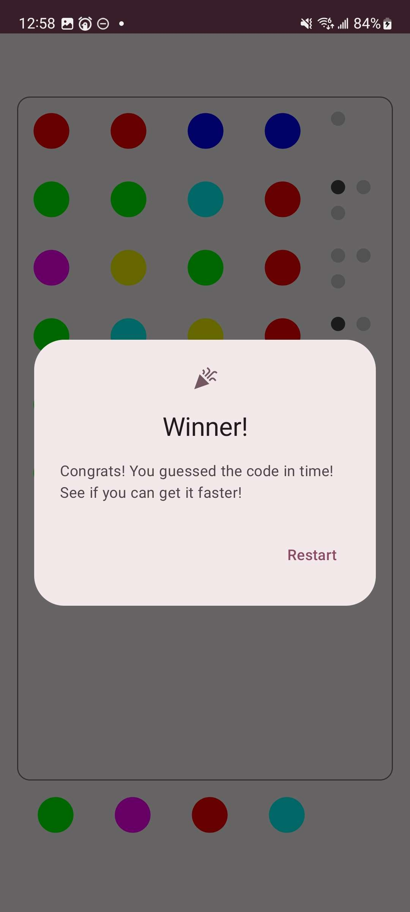
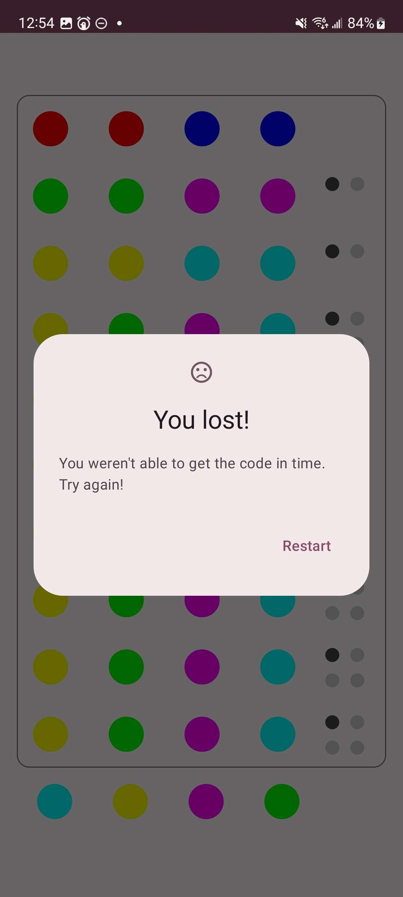

# Mastermind

Created for OTU IEC 2023

# Table of Contents
1. [Screenshots](#screenshots)
2. [What it does](#what-it-does)
3. [Tech used](#technology-we-used)
4. [Improvements](#possible-improvements)

## Screenshots
|             Winning Message              |            Losing Message             |
|:----------------------------------------:|:-------------------------------------:|
| ) |  |

## What it does
Our mobile implementation of the classic game Mastermind allows users to infinitely play against a computer controlled Mastermind. Players act as the ‘Guesser’ and try to guess the secret code that the Mastermind has picked. The game will respond with a number of light or dark pegs to represent how many guessed colors are correct and how many guessed colors are in the correct position respectively.

## Technology we used
* Android SDK
* Kotlin
* Jetpack Compose
* JUnit 4

Our team decided on creating an Android Application in Kotlin and Jetpack Compose. Our team has some experience in using Kotlin to develop Android apps which allowed us to develop a project with a proper GUI within the given time constraints. Using Compose to design the UI allowed us to quickly build out a responsive modular layout.
Using Kotlin allowed us to follow an MVVM pattern to separate what the user views from the actual logic model.
JUnit allowed us to write and execute test cases to confirm that the program’s internal logic was working as intended.

## Possible improvements
Our implementation of mastermind could be further improved by adding the following:
* Allowing a second player to act as the Mastermind and set the code
* Vary the length of the code
* Vary the amount of guesses allowed
* Splitting the GuessRow composable into two different composables